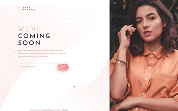
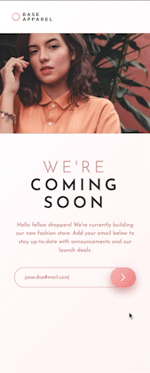

# Frontend Mentor - Base Apparel Coming Soon Page Solution

This is a solution to the [Base Apparel Coming Soon Page Challenge on Frontend Mentor](https://www.frontendmentor.io/challenges/base-apparel-coming-soon-page-5d46b47f8db8a7063f9331a0). Frontend Mentor challenges help you improve your coding skills by building realistic projects.

## Table of contents

- [Overview](#overview)
  - [The challenge](#the-challenge)
  - [Screenshot](#screenshot)
  - [Links](#links)
- [My process](#my-process)
  - [Built with](#built-with)
  - [What I learned](#what-i-learned)
- [Author](#author)

Users should be able to:

- View the optimal layout for the site depending on their device's screen size
- See hover states for all interactive elements on the page
- Receive an error message when the `form` is submitted if:
  - The `input` field is empty
  - The email address is not formatted correctly

### Screenshot

#### Screensize 1440px - Desktop



#### Screensize 375px - Mobile



### Links

- Solution URL: [Add solution URL here](https://your-solution-url.com)
- Live Site URL: [Add live site URL here](https://your-live-site-url.com)

## My process

- HTML semantics
- Importing Google Fonts
- Set variables
- Reset default settings
- Styles (Mobile First)
- JavaScript
- Media Queries

### Built with

- JavaScript
- Semantic HTML5 markup
- SASS custom properties
- CSS Grid
- CSS Flexbox
- Mobile-first workflow
- [Google Fonts](https://fonts.google.com/) - For Fonts

### What I learned

Every project gives me the opportunity to learn something new. This is the first time I worked with the Grid-Template-Area property. It improved my workflow. I will definitely going to use it on future projects to learn more about CSS Grid.

```css
.container {
  max-width: 23.438rem;
  margin-left: auto;
  margin-right: auto;
  display: grid;
  justify-items: center;
  grid-template-areas:
    "header"
    "hero"
    "main"
    "footer";
  @media only screen and (min-width: $desktop) {
    margin-left: 0;
    margin-right: 0;
    max-width: 100%;
    grid-template-columns: 1fr auto;
    grid-template-rows: auto 1fr auto;
    grid-template-areas:
      "header hero"
      "main hero"
      "footer hero";
    background-image: url(../images/bg-pattern-desktop.svg);
    background-repeat: no-repeat;
    background-attachment: fixed;
    background-position: left bottom;
    background-size: contain;
  }
}
```

## Author

- Frontend Mentor - [@kxnzx](https://www.frontendmentor.io/profile/kxnzx)
